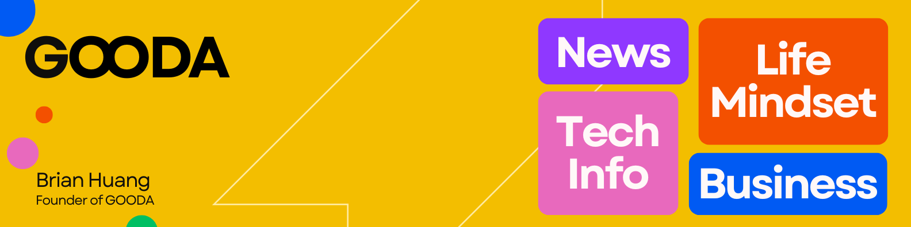

<h1 align="center">Hi 👋, I'm Johnny Boy</h1>
<h3 align="center">The founder of GOODA, and a passionate frontend developer</h3>

 

<h2>Experience</h2>

- 🔭 I’m currently working on **Microobe**

- 👯 I've created **KoTests**

- 👨‍💻 All of my projects are available at [https://gooda.my](https://gooda.my)

- 📫 How to reach me **johnnyboy@gooda.my**

 

<h2>Languages and Tools</h2>

  <strong>Language</strong>
   
  

  <strong>Front-end</strong>
    
   
  

  <strong>Back-end</strong>
  

  <strong>Database</strong>
    
    

  <strong>Deployment</strong>
   
  

  <strong>Design</strong>
  

 

<h2 align="center"> Achievement </h2>

  

  

 

<h2 align="left">Connect with me:</h2>

 

<h2 align="left">Progress</h2>

&nbsp;

